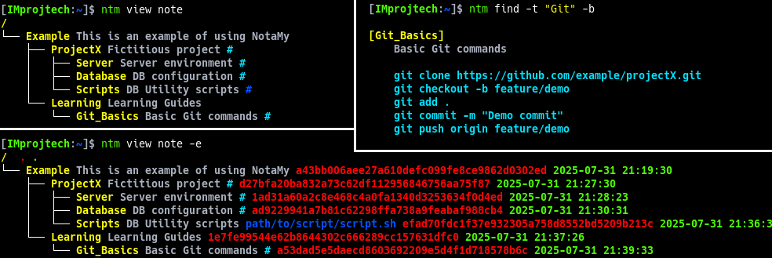

-----

# 🧠 NotaMy

Terminal-based note manager with hierarchical tagging and file linking

-----

## 📖 Program Description

NotaMy is a Linux command-line application designed to simplify the management and organization of notes and important information. It offers an intuitive interface for creating, categorizing, and viewing notes, allowing users to create a hierarchical structure using custom tags.

-----

## ✨ Main Features

  - **Note Creation:**
    Users can create notes with comments, text, and file paths, offering a comprehensive and context-aware overview.

  - **Hierarchical Organization:**
    Using tags, the program allows notes to be organized into tree-like structures, enabling flexible and customized categorization.

  - **File Links:**
    Notes can be associated with specific files, creating direct links for quick and efficient access to related resources.

  - **Terminal-Friendly Interface:**
    The program is designed for command-line interaction, offering a fast, streamlined, and distraction-free experience.

-----

## 📸 Output Examples



*Example of ntm displaying a hierarchical note structure and details of a selected tag (Git_Basics).*

-----

## 💡 Practical Applications

  - **Penetration Testing:**
    NotaMy is an valuable tool during the information-gathering phase of penetration testing, allowing operators to effectively store discoveries and access them quickly when needed.

  - **Software Development:**
    Developers can use the program to record implementation details, bug fixes, and link specific notes to parts of the code.

  - **Project Management:**
    In project management, the program can be used to record project details, milestones, and assign tags to specific tasks.

  - **Academic Research:**
    Students and researchers can organize research information, annotations, and ideas in a well-structured manner, facilitating quick navigation and retrieval of data.

  - **Educational Resources:**
    In educational settings, the program can be used to organize educational material, lessons, and links to external resources.

  - **System Administration:**
    For system administrators, it can be a valuable tool for recording network configurations, important scripts, and maintenance details.

  - **Creativity and Writing:**
    Writers and creatives may find it useful to note ideas, text fragments, and plot details in an organized manner.

  - **Password Manager:**
    With protected mode, it can also serve as a lightweight password manager.

The program's versatility allows users to adapt it to a wide range of contexts where structured data management is essential, facilitating the rapid consultation of previously saved information.

-----

## ⬇️ Download and Compilation

```sh
   git clone https://github.com/IMprojtech/NotaMy.git
   cd NotaMy
   make
   ./bin/ntm
```

-----

## 🔗 Making `NotaMy` Globally Available

After you compile `ntm`, you may want to run it from any directory without typing its full path. Here is a common approach:

### Install to a directory already in your PATH

1. Copy or move the compiled binary to a standard location, for example:

```sh
   sudo cp ./bin/ntm /usr/local/bin/
   sudo cp ./bin/ntm_nc /usr/local/bin/
```

or, if you prefer a user-local install (no `sudo` needed):

```sh
   mkdir -p "$HOME/.local/bin"
   cp ./bin/ntm "$HOME/.local/bin/"
   cp ./bin/ntm_nc "$HOME/.local/bin/"
```

Ensure that this directory is in your `PATH`. Most Linux distributions include `/usr/local/bin` by default. If you used `~/.local/bin`, make sure your shell initialization file adds it to `PATH`. For example, in `~/.bashrc` or `~/.zshrc`:

```sh
   # Add this if not already present:
   export PATH="$HOME/.local/bin:$PATH"
```

You can also simply add the bin directory of the project to your shell initialization file. For example:

```sh
export PATH="$HOME/path/to/NotaMy/bin:$PATH"
```

-----

## 📘 Documentation

A complete user manual is available with installation instructions, usage examples, and all supported commands:

📄 [Read the NotaMy Manual](docs/en/manual.md)

-----

## ⚖️ License

This program is distributed under the terms of the GNU General Public License (GPL), ensuring the freedom to redistribute and modify the software in accordance with free software standards.

-----

##  ✍️ Author

Written by Catoni Mirko (`IMprojtech`)

-----

## 🌍 Available Languages

- 🇬🇧 English (this page)
- 🇮🇹 [Italiano](docs/it/README.md)
